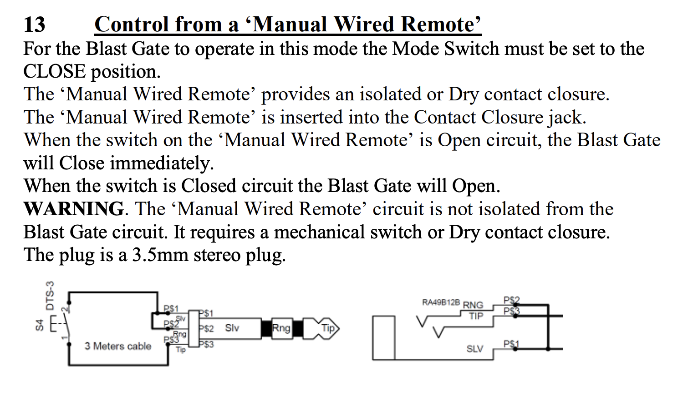

# Dust Collection

Automates dust collection in a woodworking shop using a Raspberry Pi and ESP8266 wireless buttons. When you press an "ON" button at a tool, the system activates the corresponding blast gate relay and turns on the dust collector. Pressing "OFF" shuts everything down.

## How It Works

Each tool (jointer, table saw, planer) has a wireless ESP8266 button station mounted nearby. The buttons publish MQTT messages to a MQTT broker running on a Raspberry Pi, which controls relay modules to open/close blast gates and start/stop the dust collector.

```
[ESP8266 Button] --MQTT--> [Raspberry Pi] --GPIO--> [Relays] ---> [Blast Gates + Dust Collector]
```
---

## Hardware

### Raspberry Pi

- Raspberry Pi (runs the MQTT broker and control script)
- 4-channel relay module (one relay per blast gate + one for the dust collector)

### Per-Tool Button Station

- ESP8266 board
- Momentary push buttons (one ON, one OFF) wired to GPIO5 and GPIO4

### Blast Gates

The blast gates are [Oneida iVAC Pro Blast Gates](https://www.oneida-air.com/dust-collectors/system-components/electrical/ivac/ivac-pro-blast-gates), controlled via the relay module.

The wiring for the blast gates can be seen in the diagram below:


### Pin Assignments

See `config.yml` for the full pin mapping. Summary:

| Function         | GPIO Pin |
|------------------|----------|
| Dust Collector   | 23       |
| Jointer Relay    | 17       |
| Table Saw Relay  | 27       |
| Planer Relay     | 22       |

---

## Setup

### Prerequisites

- Raspberry Pi with Raspberry Pi OS
- Python 3 with `RPi.GPIO`, `paho-mqtt`, and `PyYAML`
- Mosquitto MQTT broker installed on the Pi (`sudo apt install mosquitto`)
- [ESPHome](https://esphome.io/) CLI for flashing the ESP8266 boards

### Raspberry Pi

1. Clone the repo:
   ```sh
   git clone https://github.com/adamzimmermann/dustcollection.git
   cd dustcollection
   ```

2. Install Python dependencies:
   ```sh
   pip install paho-mqtt PyYAML RPi.GPIO
   ```

3. Start the Mosquitto MQTT broker:
   ```sh
   sudo systemctl enable mosquitto
   sudo systemctl start mosquitto
   ```

4. Run the control script:
   ```sh
   python3 dustcontrol.py
   ```

### ESP8266 Buttons

1. Install ESPHome:
   ```sh
   pip install esphome
   ```

2. Create a `secrets.yaml` file in the project root with your credentials:
   ```yaml
   wifi_ssid: "your-wifi-ssid"
   wifi_password: "your-wifi-password"
   mqtt_broker: ""  # Your Raspberry Pi's IP address
   ```

3. Flash each button board:
   ```sh
   esphome run jointer.yml
   esphome run tablesaw.yml
   esphome run planer.yml
   ```

### MQTT Topics

- `dust/<tool_id>/on` - Activates the tool's blast gate and the dust collector
- `dust/<tool_id>/off` - Deactivates all blast gates and the dust collector

Publish:
```
mosquitto_pub -h PI_IP_ADDRESS -t "dust/jointer/on" -m "1"
```
Listen:
```
mosquitto_sub -h PI_IP_ADDRESS -t "dust/#" -v
```
